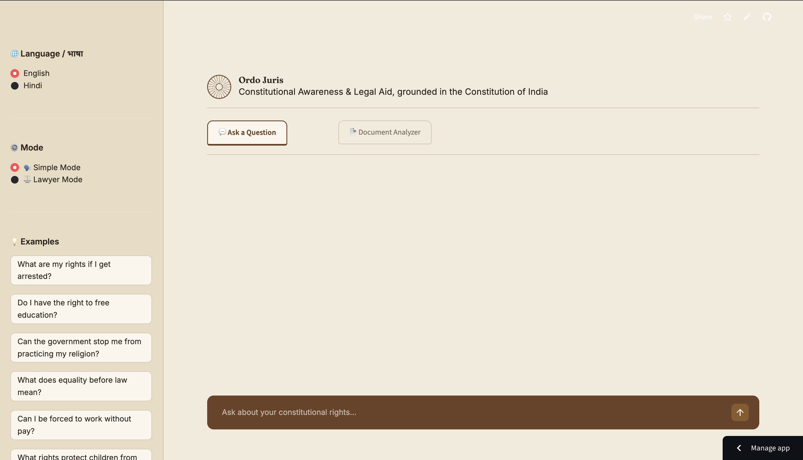
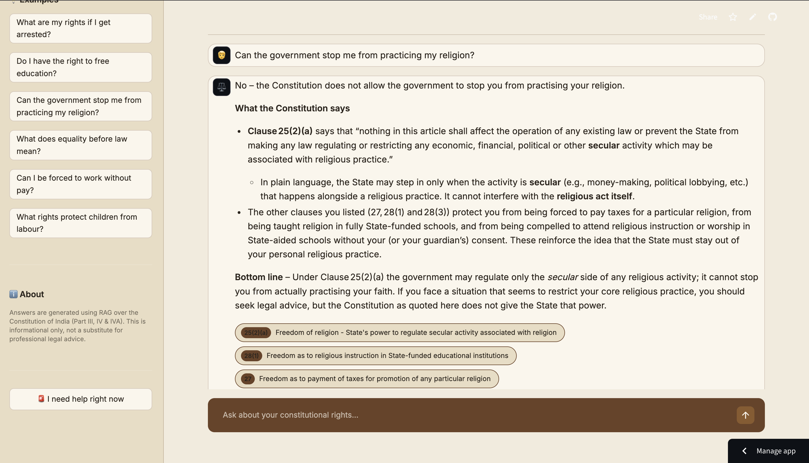
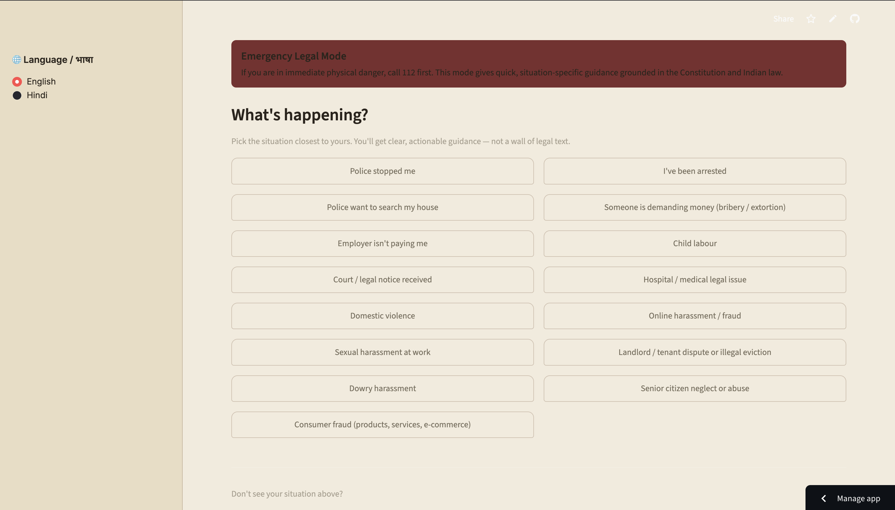
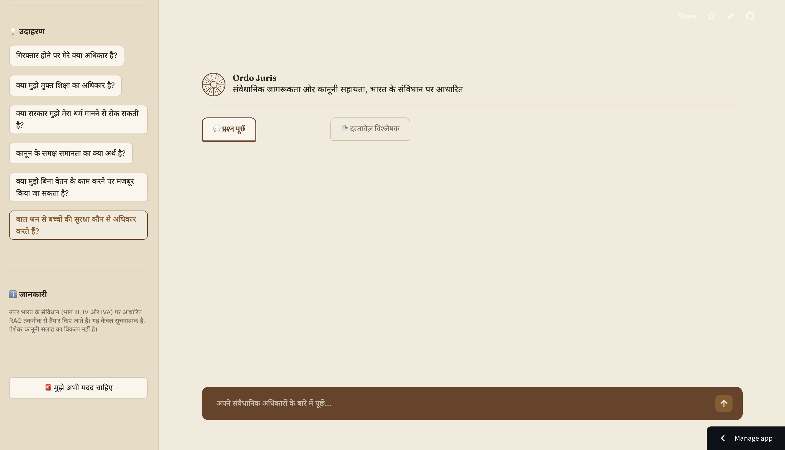
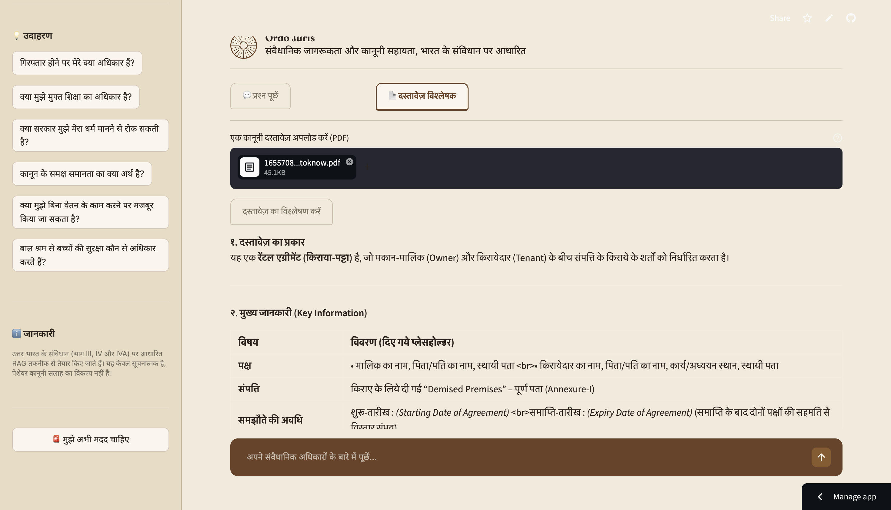

# Ordo Juris

Constitutional Awareness and Legal Aid Chatbot, built for AIML-06 Hackathon.

Ordo Juris is a RAG-powered chatbot that answers constitutional and legal rights questions using the actual text of the Indian Constitution, with citation-backed accuracy, plain-language explanations, and full bilingual (English/Hindi) support.

Live Demo: https://ordo-juris.streamlit.app/

## Features

- RAG-grounded answers, every response is retrieved from a curated constitutional dataset (Fundamental Rights, Directive Principles, Fundamental Duties, Preamble) before generation, so answers are traceable to a specific clause, not hallucinated.
- Two response modes, Simple Mode for plain-language explanations, Lawyer Mode for formal citations and landmark case law.
- Full bilingual support, English and Hindi, across the entire UI, not just answers.
- Emergency Legal Mode, step-by-step guidance for 15 real-world urgent situations (arrest, domestic violence, workplace harassment, etc.) with relevant articles, case law, and helpline numbers.
- Document Analyzer, upload a legal document (PDF) and get a plain-language summary with recommended next steps.
- PWA support, installable as a home-screen app on mobile.

## Screenshots

## Tech Stack

- Frontend: Streamlit (custom-styled UI)
- Retrieval: Sentence-Transformers (all-MiniLM-L6-v2) plus FAISS vector search
- LLM: Groq API (openai/gpt-oss-120b)
- PDF parsing: pypdf

## Project Structure

constitution-bot/
- app.py, Main Streamlit app
- rag_engine.py, RAG retrieval and LLM answering logic
- build_index.py, Builds the FAISS index from data.json
- data.json, Curated constitutional dataset (clause-level)
- emergency_scenarios.py, Emergency mode content (English and Hindi)
- emergency_mode.py, Emergency mode UI logic
- pdf_utils.py, PDF text extraction
- requirements.txt
- .streamlit/config.toml, Streamlit config (static file serving for PWA)

## Setup Instructions

1. Clone the repo

git clone https://github.com/evs-debug/legal-chatbot.git
cd legal-chatbot/constitution-bot

2. Create a virtual environment

python3 -m venv venv
source venv/bin/activate

On Windows use venv\Scripts\activate instead

3. Install dependencies

pip install -r requirements.txt

4. Add your Groq API key

Create a .env file in the constitution-bot folder with this line:
GROQ_API_KEY=your_key_here

Get a free key at console.groq.com/keys

5. Run the app

streamlit run app.py

The app will open at http://localhost:8501

## Team

- Eva Sharma
- Sinhayana Naruka
- Rithika Mahesh

## License

MIT License, see LICENSE file for details.

## Disclaimer

Ordo Juris provides general legal information for awareness purposes only. It is not a substitute for professional legal advice. For serious legal matters, please consult a qualified lawyer.
